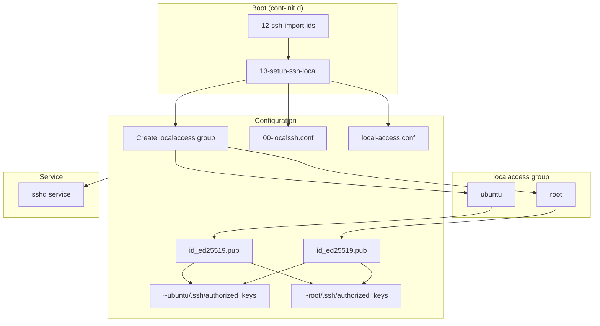
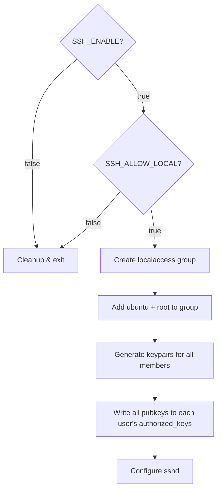

# SSH Configuration

How SSH is configured and managed in the OpenClaw container.

## Overview



## Environment Variables

| Variable | Default | Description |
| -------- | ------- | ----------- |
| `SSH_ENABLE` | `false` | Enable SSH server |
| `SSH_ALLOW_LOCAL` | `true` | Allow ubuntu user to SSH to root/openclaw from localhost |
| `GITHUB_USERNAME` | - | Import SSH keys from GitHub for ubuntu user |
| `SSH_AUTHORIZED_USERS` | - | Additional SSH public keys for ubuntu user |
| `PUBLIC_SSH_LOCALACCESS` | `true` | Make openclaw wrapper use local SSH by default |

## Configuration Files

### `/etc/ssh/sshd_config.d/00-localssh.conf`

Base SSH configuration (managed by `13-setup-ssh-local`):

```
PermitRootLogin no
PasswordAuthentication no
PubkeyAuthentication yes
AuthorizedKeysFile .ssh/authorized_keys
UsePAM yes
AcceptEnv MOTD_SKIP
```

### `/etc/ssh/sshd_config.d/local-access.conf`

Allows root login from localhost only (created when SSH_ALLOW_LOCAL=true):

```
Match Address 127.0.0.1,::1
    PermitRootLogin yes
```

## Init Scripts

### `12-ssh-import-ids`

Imports SSH keys for the ubuntu user from:
1. GitHub (if `GITHUB_USERNAME` set)
2. `SSH_AUTHORIZED_USERS` environment variable

Keys are written to `/home/ubuntu/.ssh/authorized_keys`.

### `13-setup-ssh-local`

Configures local SSH access using the `localaccess` group:



**Cleanup** removes:
- Local access keys from each user's `~/.ssh/authorized_keys`
- `/etc/ssh/sshd_config.d/local-access.conf`

## The localaccess Group

Users in the `localaccess` group can SSH to any user on localhost. By default, `ubuntu` and `root` are members.

To add another user:
```bash
usermod -aG localaccess myuser
/usr/local/bin/ssh-rotate-local-key  # Regenerate keys
```

## Key Rotation

SSH keypairs for all `localaccess` group members are rotated:
- **On boot**: Fresh keypairs generated by `13-setup-ssh-local`
- **Daily**: Cron job at midnight (`/etc/cron.d/ssh-rotate-local-key`)

The rotation script (`/usr/local/bin/ssh-rotate-local-key`):
1. Iterates through all `localaccess` group members
2. Generates new ed25519 keypair for each user
3. Writes all public keys to each user's `~/.ssh/authorized_keys` (with markers)

## Usage Examples

### Remote SSH (External Access)

Requires importing keys via `GITHUB_USERNAME` or `SSH_AUTHORIZED_USERS`:

```bash
# From your local machine
ssh ubuntu@<tailscale-hostname>
```

### Local SSH (Console to Other Users)

When attached to console as ubuntu:

```bash
# SSH to root
ssh root@localhost

# SSH to openclaw (for proper environment)
ssh openclaw@localhost

# Transfer files
scp /tmp/file.txt openclaw@localhost:/home/openclaw/
scp root@localhost:/etc/config.yaml /tmp/
```

### Running OpenClaw Commands

```bash
# Option 1: Use the wrapper (works from any user)
openclaw channels login

# Option 2: SSH to openclaw for interactive session
ssh openclaw@localhost
openclaw channels login
```

## Troubleshooting

### Permission Denied

Check that:
1. `SSH_ENABLE=true` is set
2. `SSH_ALLOW_LOCAL=true` is set (for local access)
3. sshd service is running: `/command/s6-svok /run/service/sshd`
4. Keys exist: `ls -la /home/ubuntu/.ssh/`
5. Local access keys are present: `grep "LOCAL ACCESS" ~/.ssh/authorized_keys`

### Service Not Starting

```bash
# Check service status
/command/s6-svok /run/service/sshd && echo "up" || echo "down"

# Check logs (sshd runs in foreground with -e)
# Restart to see output
/command/s6-svc -r /run/service/sshd
```

### Config Not Applied

Verify config files exist and have correct content:

```bash
cat /etc/ssh/sshd_config.d/00-localssh.conf
cat /etc/ssh/sshd_config.d/local-access.conf
```

Restart sshd after config changes:
```bash
/command/s6-svc -r /run/service/sshd
```

## Related Files

| File | Purpose |
| ---- | ------- |
| `/etc/cont-init.d/12-ssh-import-ids` | Import keys from GitHub/env |
| `/etc/cont-init.d/13-setup-ssh-local` | Configure local SSH access |
| `/etc/services.d/sshd/run` | sshd service script |
| `/etc/ssh/sshd_config.d/00-localssh.conf` | Base SSH config |
| `/etc/ssh/sshd_config.d/local-access.conf` | Local root access config |
| `/etc/cron.d/ssh-rotate-local-key` | Daily key rotation |
| `/usr/local/bin/ssh-rotate-local-key` | Key rotation script |
| `/home/ubuntu/.ssh/authorized_keys` | Ubuntu's authorized keys (external + local) |
| `/root/.ssh/authorized_keys` | Root's authorized keys (local access) |
